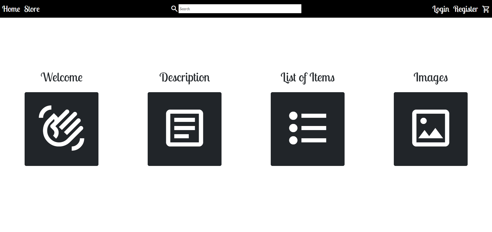
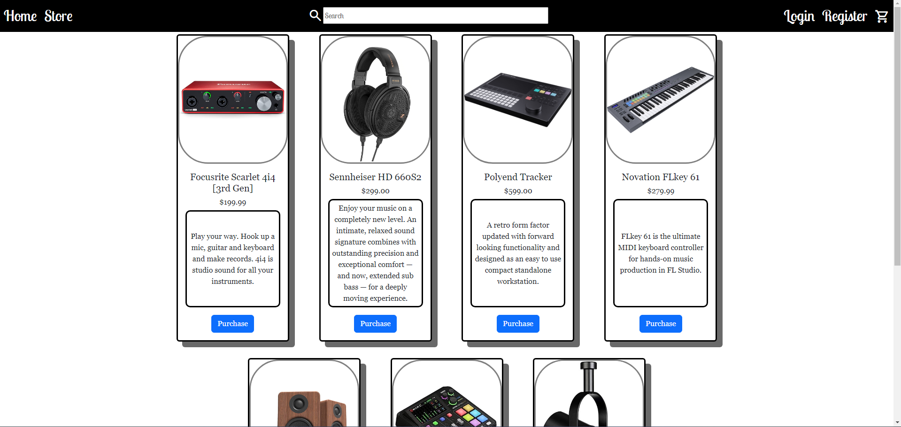
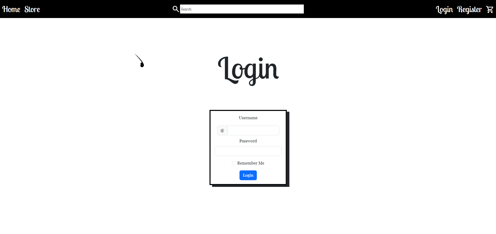

# Capstone1
Ecommerce Site

This is an ecommerce page I made to display musical equipment and devices, most of which I want myself. You could consider it my own personal wihslist. There is a brush trail on the mouse that I copied from someone else Javascript. Getting it to interact (or lack thereof) with the rest of my website took a bit of editing the Javascript.

# Home Page [home](home.html)
I used modals to introduce the user to the webpage, provide a description,
list the items of the page, and showcase the images used.

# Store Page
I used Bootstrap cards to display the products for the store. Getting the card description text to be styled right was annoying, but I got it done.

# Login Page
The Login page is just a simple box form in the middle of the screen with a button that makes sure the fields have inputs in them, along with a checkbox for "Remember Me."

# Register Page
The Register page is the same as the login page, except with a dropdown for the state selector and some radio buttons for the "How did you hear about us?" and the checkbox is for "Terms and Conditions" instead.

# Cart Page
A table for the items in the cart, and a form for the shipping information along with a "Checkout button." I liked making this page the least, because I think that tables are ugly (with my limited knowledge of them as of now).

# Interesting Code

The most interesting code I've written was for the modals on the home page, getting the buttons the way I wanted them and then styling the modals right took some time but was the second most satisfying thing to add to my store. (The first was the mouse trail, but that code wasn't mine, despite me having to edit it to get it to work on my site.) I enjoyed making this website! I worked on it during my free time - something I don't do unless I'm enjoying myself - and I found it to be extremely frustrating, but because of that frustration, it was all the more gratifying in the end.